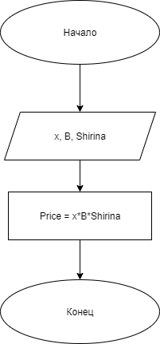

# Домашнее задание к работе 2

## Условие задачи
В магазине продается костюмная ткань. Ее цена В рублей за кв. Метр. Напишите программу, которая подсчитает и выведет на экран стоимость куска этой ткани длиной х м и шириной 80 см.

## 1.Алгоритм и блок-схема

# Алгоритм
1. **Начало**
2. Объявить константы:
   - `Shirina` = 0.8 м — ширина ткани.
3. Задать исходные данные:
   - `x` — длинна ткани в метрах.
   - `B` — цена за 1 квадратный метр.
4. Вычислить стоимость ткани:
   - `price` = `x` * `B` * `Shitina`
8. Вывести результаты расчетов с подстановкой всех значений в текст.
9. **Конец**

10. ### Блок-схема

## 2. Реализация программы

- #include <stdio.h>
- #include <locale.h>
- int main()
- {
- const float Shirina = 0.8;  // ширина ткани
- float x = 4.0;  // длинна ткани
- 	int B = 50;  // цена за 1 кв метр ткани
- 	float price = x * Shirina * B;
- 	setlocale(LC_CTYPE, "RUS");
- 	printf("Расчёт цены ткани\n");
- 	printf("=================\n");
- 	printf("Цена за 1 кв м ткани равна %d рублей\n", B);
- 	printf("Ткань длинной %.1f метров и шириной %.1f метров\n", x, Shirina);
- 	printf("Цена такой ткани равна: %.1f рублей\n", price);
- }

## 3. Результаты работы программы

- Расчёт цены ткани
- =================
- Цена за 1 кв м ткани равна 50 рублей
- Ткань длинной 4.0 метров и шириной 0.8 метров
- Цена такой ткани равна: 160.0 рублей

## 4. Информация о разработчике

Капустин Андрей, группа бИЦ-252
